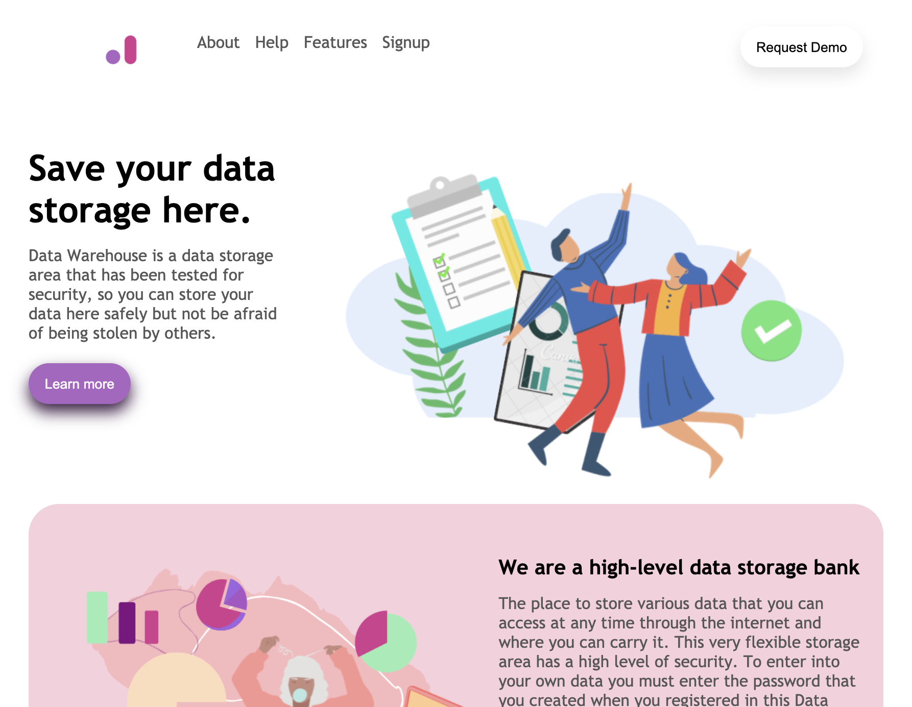

# Figma Data Warehouse

### _A recreated, static application that is HTML and CSS engineered for presentation purposes only._

## Table of Contents

- [Media](#Media)

- [Deployed Site](#deployed-site)

- [Features](#Features)

- [Contributors](#Contributors)

- [Contact](#Contact)

- [Project Status](#project-status)

- [License](#License)

## Media

### The Project:

### What I produced:

## Deployed Site

   This is the link to view my portfolio: (https://celestealexmoore.github.io/figma/)

## Features
    - Single-page application
    - Responsive CSS to adapt to mobile device

## Contributors

This website was created by Celeste Moore.

## Contact

If you have any questions about this repository, contact celestealexmoore via GitHub or reach out via email:
celestealexmoore@gmail.com.

## Project Status

Completed

---

## License

© 2021 _celestealexmoore_